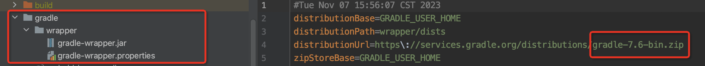

## Version restrictions

Minimum Gradle version: 7.6👇 (supports 8.0 and above)



Minimum SDK version: minSdkVersion >= 21

## Steps for usage

**Can you give the project a Star before starting? Thank you very much, your support is my only motivation. Stars and Issues are welcome!**

<p style="color:red;">The repository address of this library is in Maven central. If you cannot get the dependent package, please put the mirror address such as Alibaba after mavenCentral()</p>

### 1. Introduce the plug-in, choose one of the two methods below (required)

#### Method 1: ```apply``` method


Depend on the plug-in in `build.gradle` in the **project root directory**

=== "Groovy"

    - Using the **plugins DSL**:
        ```groovy
        
        plugins {
          //👇Required item (1)👈 apply is set to true to automatically apply debugMode to all modules, If false, follow step 5 below to configure debugMode in manual mode.
          id "io.github.FlyJingFish.AndroidAop.android-aop" version "2.6.3" apply true
        }
        ```

        1.  :man_raising_hand: If you have the `com.google.dagger.hilt.android` plugin in your project, put this plugin before it.

    - Using **legacy plugin application**:
    
        ```groovy
        buildscript {
             dependencies {
                 //👇equired items (1)👈
                 classpath "io.github.FlyJingFish.AndroidAop:android-aop-plugin:2.6.3"
             }
        }
        //👇Add this sentence to automatically apply debugMode to all modules. If not, follow step 5 below to configure debugMode in manual mode.
        apply plugin: "android.aop"
        ```

        1.  :man_raising_hand: If you have the `com.google.dagger:hilt-android-gradle-plugin` plugin in your project, put this plugin before it.

=== "Kotlin"

    - Using the **plugins DSL**:
        ```kotlin
        
        plugins {
          //👇Required item (1)👈 apply is set to true to automatically apply debugMode to all modules, If false, follow step 5 below to configure debugMode in manual mode.
          id("io.github.FlyJingFish.AndroidAop.android-aop") version "2.6.3" apply true
        }
        ```

        1.  :man_raising_hand: If you have the `com.google.dagger.hilt.android` plugin in your project, put this plugin before it.

    - Using **legacy plugin application**:
    
        ```kotlin
        buildscript {
             dependencies {
                 //👇Required items (1)👈
                 classpath("io.github.FlyJingFish.AndroidAop:android-aop-plugin:2.6.3")
             }
        }
        //👇Add this sentence to automatically apply debugMode to all modules. If not, follow step 5 below to configure debugMode in manual mode.
        apply(plugin = "android.aop")
        ```

        1.  :man_raising_hand: If you have the `com.google.dagger:hilt-android-gradle-plugin` plugin in your project, put this plugin before it.

!!! note
    **If you use the hilt plugin in your project, pay attention to the order of importing plugins mentioned in the article (click the "+" above to see more information)**


Add in `build.gradle` of **app**

=== "Groovy"

    - Using the **plugins DSL**:

        ```groovy
        //Required items 👇
        plugins {
            ...
            id 'android.aop'//It is best to put it on the last line
        }
        ```
    
    - Using **legacy plugin application**:
    
        ```groovy
        //Required items 👇
        apply plugin: 'android.aop' //It's best to put it on the last line
        ```

=== "Kotlin"

    - Using the **plugins DSL**:

        ```kotlin
        //Required items 👇
        plugins {
            ...
            id("android.aop")//It is best to put it on the last line
        }
        ```
    
    - Using **legacy plugin application**:
    
        ```kotlin
        //Required items 👇
        apply(plugin = "android.aop") //It's best to put it on the last line
        ```

!!! warning
    **:warning::warning::warning:`id 'android.aop'` should be placed at the last line, especially after `id 'com.android.application'` or `id 'com.android.library'`**


#### ~~Method 2: ```plugins``` method~~

- Add directly to ```build.gradle``` of **app**

=== "Groovy"

    ```groovy
    //Required items 👇
    plugins {
       ...
       id "io.github.FlyJingFish.AndroidAop.android-aop" version "2.6.3"
    }
    ```

=== "Kotlin"

    ```kotlin
    //Required items 👇
    plugins {
       ...
       id("io.github.FlyJingFish.AndroidAop.android-aop") version "2.6.3"
    }
    ```

### 2. If you need to customize aspects, and the code is ```Kotlin``` (optional)

- Depend on the plug-in in ```build.gradle``` in the **project root directory**

=== "Groovy"

    ```groovy
    
    plugins {
        //Optional 👇, if you need to customize aspects and use the android-aop-ksp library, you need to configure it. The version number below is determined according to the Kotlin version of your project
        id 'com.google.devtools.ksp' version '1.8.0-1.0.9' apply false
    }
    ```

=== "Kotlin"


    ```kotlin
    
    plugins {
        //Optional 👇, if you need to customize aspects and use the android-aop-ksp library, you need to configure it. The version number below is determined according to the Kotlin version of your project
        id("com.google.devtools.ksp") version "1.8.0-1.0.9" apply false
    }
    ```

[List of matching version numbers for Kotlin and KSP Github](https://github.com/google/ksp/releases)

### 3. Introduce dependent libraries (required)

=== "Groovy"

    ```groovy
    plugins {
         //Optional 👇, if you need to customize aspects and use the android-aop-ksp library, you need to configure it
         id 'com.google.devtools.ksp'
    }
    
    dependencies {
         //👇Required items 
         implementation "io.github.FlyJingFish.AndroidAop:android-aop-core:2.6.3"
         //👇Optional (1)👈 This package provides some common annotation aspects
         implementation "io.github.FlyJingFish.AndroidAop:android-aop-extra:2.6.3"
        
         //👇Required item  If you already have this item in your project, you don’t need to add it.
         implementation "androidx.appcompat:appcompat:1.3.0" // At least in 1.3.0 and above
         
         //👇Optional (2)👈Click + to view detailed description, ⚠️supports aspects written in Java and Kotlin code
         ksp "io.github.FlyJingFish.AndroidAop:android-aop-ksp:2.6.3"
         //👇Optional (3)👈Click + to view detailed description, ⚠️only applies to aspects written in Java code
         annotationProcessor "io.github.FlyJingFish.AndroidAop:android-aop-processor:2.6.3"
         //⚠️Choose one of the above android-aop-ksp and android-aop-processor
         //If you only use the functions in android-aop-extra, you don't need to select these two options
    }
    ```

    1. :man_raising_hand: This library has built-in annotations for some functions defined using [@AndroidAopPointCut](/AndroidAOP/AndroidAopPointCut/)
    2. :man_raising_hand: When you use the five custom aspect annotations [introduced here](#custom-aspects), it means that you must choose one from `android-aop-ksp` and `android-aop-processor` as a required option
    3. :man_raising_hand: When you use the five custom aspect annotations [introduced here](#custom-aspects), it means that you must choose one from `android-aop-ksp` and `android-aop-processor` as a required option

=== "Kotlin"
    
    ```kotlin
    plugins {
         //Optional 👇, if you need to customize aspects and use the android-aop-ksp library, you need to configure it
         id("com.google.devtools.ksp")
    }
    
    dependencies {
         //👇Required items 
         implementation("io.github.FlyJingFish.AndroidAop:android-aop-core:2.6.3")
         //👇Optional (1)👈 This package provides some common annotation aspects
         implementation("io.github.FlyJingFish.AndroidAop:android-aop-extra:2.6.3")
        
         //👇Required item  If you already have this item in your project, you don’t need to add it.
         implementation("androidx.appcompat:appcompat:1.3.0") // At least in 1.3.0 and above
         
         //👇Optional (2)👈Click + to view detailed description, ⚠️supports aspects written in Java and Kotlin code
         ksp("io.github.FlyJingFish.AndroidAop:android-aop-ksp:2.6.3")
         //👇Optional (3)👈Click + to view detailed description, ⚠️only applies to aspects written in Java code
         annotationProcessor("io.github.FlyJingFish.AndroidAop:android-aop-processor:2.6.3")
         //⚠️Choose one of the above android-aop-ksp and android-aop-processor
         //If you only use the functions in android-aop-extra, you don't need to select these two options
    }
    ```

    1. :man_raising_hand: This library has built-in annotations for some functions defined using [@AndroidAopPointCut](/AndroidAOP/AndroidAopPointCut/)
    2. :man_raising_hand: When you use the five custom aspect annotations [introduced here](#custom-aspects), it means that you must choose one from `android-aop-ksp` and `android-aop-processor` as a required option
    3. :man_raising_hand: When you use the five custom aspect annotations [introduced here](#custom-aspects), it means that you must choose one from `android-aop-ksp` and `android-aop-processor` as a required option

!!! note
    Tip: ksp or annotationProcessor can only scan the current module. Custom aspect codes are added to the module where they are located. **But custom aspect codes are globally effective**; required dependencies can be added only to public modules through the API.

### 4. Add the androidAopConfig configuration item in app’s build.gradle (this step is an optional configuration item)

- Related development configurations

=== "Groovy"

    ```groovy
    plugins {
         ...
         id 'android.aop'//It is best to put it on the last line
    }
    androidAopConfig {
         // enabled is false, the aspect no longer works, the default is not written as true
         enabled true
         // include does not set all scans by default. After setting, only the code of the set package name will be scanned.
         include 'Package name of your project', 'Package name of custom module', 'Package name of custom module'
         // exclude is the package excluded during scanning
         // Can exclude kotlin related and improve speed
         exclude 'kotlin.jvm', 'kotlin.internal','kotlinx.coroutines.internal', 'kotlinx.coroutines.android'
         // Exclude packaged entity names
         excludePackaging 'license/NOTICE' , 'license/LICENSE.dom-software.txt' , 'license/LICENSE'

         // verifyLeafExtends Whether to turn on verification leaf inheritance, it is turned on by default. If type = MatchType.LEAF_EXTENDS of @AndroidAopMatchClassMethod is not set, it can be turned off.
         verifyLeafExtends true
         //Disabled by default. Enabled after Build or Packaging, a cut information file will be generated in app/build/tmp/ (cutInfo.json, cutInfo.html)
         cutInfoJson false
    }
    android {
         ...
    }
    ```

=== "Kotlin"

    
    ```kotlin
    plugins {
         ...
         id("android.aop")//It is best to put it on the last line
    }
    androidAopConfig {
         // enabled is false, the aspect no longer works, the default is not written as true
         enabled = true
         // include does not set all scans by default. After setting, only the code of the set package name will be scanned.
         include("Package name of your project", "Package name of custom module", "Package name of custom module")
         // exclude is the package excluded during scanning
         // Can exclude kotlin related and improve speed
         exclude("kotlin.jvm", "kotlin.internal","kotlinx.coroutines.internal", "kotlinx.coroutines.android")
         // Exclude the entity name of the package
         excludePackaging("license/NOTICE" , "license/LICENSE.dom-software.txt" , "license/LICENSE")

         // verifyLeafExtends Whether to turn on verification leaf inheritance, it is turned on by default. If type = MatchType.LEAF_EXTENDS of @AndroidAopMatchClassMethod is not set, it can be turned off.
         verifyLeafExtends = true
         //Disabled by default. Enabled after Build or Packaging, a cut information file will be generated in app/build/tmp/ (cutInfo.json, cutInfo.html)
         cutInfoJson = false
    }
    android {
         ...
    }
    ```

!!! note
    1. Include and exclude support precise setting to a class<br>
    2. Reasonable use of include and exclude can improve compilation speed. It is recommended to use include to set the relevant package name of your project (including app and custom module)<br>
    3. If `LEAF_EXTENDS` is not set for `@AndroidAopMatchClassMethod` and `@AndroidAopCollectMethod`, setting `verifyLeafExtends` to false can also speed up

!!! warning
    :warning::warning::warning:After setting include and exclude, all aspects are only valid within the rules you set. Please remember your settings! In addition, since Android Studio may have cache after setting here, it is recommended to clean before continuing development

### 5. You can set the packaging method during development (this step is an optional configuration item, it is recommended to configure this item to speed up development)

#### :pushpin: Method 1 (fastDex mode)

Add the following settings to `gradle.properties` in the **root directory** (optional)

```properties
androidAop.fastDex = true //Accelerate the dexBuilder phase (default false)
androidAop.fastDex.variantOnlyDebug = false //Only works in debug (default false)
```

!!! note
    1、When `androidAop.fastDex` is set to true, the dexBuilder task will be optimized and accelerated by **incremental compilation**. Please note that this setting will only work when not in debugMode mode<br>
    2、When `androidAop.fastDex.variantOnlyDebug` is set to true, the release package will ignore `androidAop.fastDex = true` Settings<br>
    3、If there are other plugins using `toTransform` in your project, please adjust the task execution order and put the `xxAssembleAndroidAopTask` task at the end, otherwise the effect will be discounted.<br>
    4、If your project has other plugins that use `toTransform`, such as some Routers, it is recommended to use this method.

#### :pushpin: Method 2 (debugMode)

<p style="color:red;">If you configure DebugMode in this step, please read the instructions in each line below carefully and do not copy them blindly, especially if you want to cut third-party jar packages.</p>

<p style="color:#FF8C00;">The following configuration steps also apply to componentized scenarios <a href="https://flyjingfish.github.io/AndroidAOP/FAQ/#14-different-modules-of-componentized-projects-use-products-such-as-aar-for-compilation-how-to-speed-up-the-packaging-speed">Click here to view</a> </p>


For **all sub-modules** also rely on plug-ins, please follow the above [step 1 method 1 to configure the project](#1-introduce-the-plug-in-choose-one-of-the-two-methods-below-required), then choose one of the following methods

- **Method 1 (recommended):**
  
    Follow the above [Step 1 Method 1 Configuration Project](#1-introduce-the-plug-in-choose-one-of-the-two-methods-below-required) and you are done. **This method automatically applies debugMode to all Android modules**

- **Method 2:**
  
    Please configure the project according to the above [Step 1 Method 1 to configure the project](#1-introduce-the-plug-in-choose-one-of-the-two-methods-below-required), and then manually set the required sub-module module, for example:

    === "Groovy"

        ```groovy
        plugins {
             ...
             id 'android.aop'//It is best to put it on the last line
        }
        ```

    === "Kotlin"

        ```kotlin
        plugins {
             ...
             id("android.aop")//It is best to put it on the last line
        }
        ```

!!! note
    1. This method can only apply debugMode to the modules you have added, and the related aspects in the modules that have not been added will not take effect <br>
    2. If your module is a Java or Kotlin library, this method can only enable all Android libraries. You need to use method 2 to configure your module separately for it to take effect.


Add the following settings in `gradle.properties` in the **root directory**


```properties
androidAop.debugMode=true //Set to true to use the current packaging method of your project, false to use the full packaging method, otherwise the default is false
```

!!! warning
    1、:warning::warning::warning: Please note that when set to true, the compilation speed will be faster but some functions will be invalid. Only the aop code will be woven into the set module. The third-party jar package will not weave in the code, so please be careful to turn it off when building the official package. Configure this and clean the project <br>
    2、If `org.gradle.parallel = true` is set, please pay attention to adjust the order of each module **compileXXJavaWithJavac** task if there is a bug. If not, you can choose to turn off this configuration directly.


Add the following settings in `gradle.properties` in the **root directory**

```properties
androidAop.debugMode.variantOnlyDebug = true //If this is not written by default, it is true
```

!!! note
    1.If this option is not set, it will be true by default. Please note that when it is set to true, the release package will ignore the setting of `androidAop.debugMode = true` and automatically use the full packaging method. When it is set to false, there will be no such effect <br>
    2.This feature is enabled by default, so the release package does not need to manually disable `androidAop.debugMode` <br>
    **3. This feature is only valid for Android libraries, not for Java or Kotlin libraries**


Add the following settings to `gradle.properties` in the **root directory** (optional)


```properties
androidAop.debugMode.buildConfig = true //If set to true, it means exporting a DebugModeBuildConfig.java file. If not set, the default value is false.
```

!!! note
    1、Because some modules have only Kotlin code, debugMode cannot take effect. You can insert a Java code to make it effective by setting it to true. If you don't need it, you can set it to false, but you need to manually create a Java code.<br>
    2、If debugMode does not work, consider turning this off by adding the setting `android.defaults.buildfeatures.buildconfig=true`

#### :pushpin: Other configurations (optional, you can configure this if you want to be the best)

Add the following settings to `gradle.properties` in the **root directory** 

```properties
androidAop.reflectInvokeMethod = true //Set to true to reflect the execution of the facet method, if not set, the default is false
androidAop.reflectInvokeMethod.variantOnlyDebug = true //Set to true to be effective only in debug, if not set, the default is false
androidAop.reflectInvokeMethod.static = true // Set to true to simulate non-reflective situations. If not set, the default value is true.
```
!!! note
    1. `androidAop.reflectInvokeMethod` is set to true to reflect the execution of the section method, which will speed up the packaging speed. If it is set to false, the secondary compilation speed is basically the same as the reflection speed. <br>
    2. Please note that when `androidAop.reflectInvokeMethod.variantOnlyDebug` is set to true, the release package will ignore the setting of `androidAop.reflectInvokeMethod = true` and automatically not reflect. If it is set to false, there will be no such effect (default false if not written) <br>
    3. `androidAop.reflectInvokeMethod.static` is set to true to simulate the non-reflective situation and take into account the compilation speed of reflection. If it is not written, the default is true. If you want to use reflection, it is recommended to set this to true. Set it to false for pure reflection <br>
    4. **`androidAop.reflectInvokeMethod.variantOnlyDebug` is only valid for Android libraries, not for Java or Kotlin libraries**

#### :pushpin: CleanKeepAopCache

When you want to clean the project, you can use this command to reduce the compilation time after cleaning

- Use in the command line

    ```
    ./gradlew aaaCleanKeepAopCache
    ```

- Double-click the command

    

If you can't find the `aaaCleanKeepAopCache` command, you need to add the following settings to the `build.gradle` in the **root directory**

=== "Groovy"

    ```groovy
    apply plugin: 'android.aop.clean'
    ```

=== "Kotlin"

    ```kotlin
    apply(plugin = "android.aop.clean")
    ```

### This library has some built-in functional annotations for you to use directly.

| Annotation name          |                                                                            Parameter description                                                                            |                                                                          Function description                                                                           |
|--------------------------|:---------------------------------------------------------------------------------------------------------------------------------------------------------------------------:|:-----------------------------------------------------------------------------------------------------------------------------------------------------------------------:|
| @SingleClick             |                                                              value = interval of quick clicks, default 1000ms                                                               |                                      Click the annotation and add this annotation to make your method accessible only when clicked                                      |
| @DoubleClick             |                                                           value = maximum time between two clicks, default 300ms                                                            |                                   Double-click annotation, add this annotation to make your method enterable only when double-clicked                                   |
| @IOThread                |                                                                          ThreadType = thread type                                                                           |                      Switch to the sub-thread operation. Adding this annotation can switch the code in your method to the sub-thread for execution                      |
| @MainThread              |                                                                                No parameters                                                                                |                The operation of switching to the main thread. Adding this annotation can switch the code in your method to the main thread for execution                |
| @OnLifecycle<sup>*</sup> |                                                                           value = Lifecycle.Event                                                                           |              Monitor life cycle operations. Adding this annotation allows the code in your method to be executed only during the corresponding life cycle               |
| @TryCatch                |                                                                        value = a flag you customized                                                                        |                                                Adding this annotation can wrap a layer of try catch code for your method                                                |
| @Permission<sup>*</sup>  |                                                                     value = String array of permissions                                                                     |                 The operation of applying for permissions. Adding this annotation will enable your code to be executed only after obtaining permissions                 |
| @Scheduled               | initialDelay = delayed start time<br>interval = interval<br>repeatCount = number of repetitions<br>isOnMainThread = whether to be the main thread<br>id = unique identifier |       Scheduled tasks, add this annotation to make your method Executed every once in a while, call AndroidAop.shutdownNow(id) or AndroidAop.shutdown(id) to stop       |
| @Delay                   |                                          delay = delay time<br>isOnMainThread = whether the main thread<br>id = unique identifier                                           | Delay task, add this annotation to delay the execution of your method for a period of time, call AndroidAop.shutdownNow(id) or AndroidAop .shutdown(id) can be canceled |
| @CheckNetwork            |                   tag = custom tag<br>toastText = toast prompt when there is no network<br>invokeListener = whether to take over the check network logic                    |                       Check whether the network is available, adding this annotation will allow your method to enter only when there is a network                       |
| @CustomIntercept         |                                                            value = a flag of a string array that you customized                                                             |                                          Custom interception, used with AndroidAop.setOnCustomInterceptListener, is a panacea                                           |

!!! note
    The above functions are located in the `android-aop-extra` library. [For detailed instructions, please see the documentation](/AndroidAOP/android_aop_extra/)

## Custom Aspects

*[Custom Aspects]: Using the following features means you must choose one of <code>android-aop-ksp</code> and <code>android-aop-processor</code> as a dependency

This introduction is a general outline.

- @AndroidAopPointCut is an aspect that annotates methods
- @AndroidAopMatchClassMethod is the aspect of matching class methods
- @AndroidAopReplaceClass is called by the replacement method
- @AndroidAopModifyExtendsClass is a modified inherited class
- @AndroidAopCollectMethod Is a collection inheritance class

#### **@AndroidAopPointCut** 

&emsp;&emsp;It is used to make aspects in the form of annotations on the method. The above annotations are all made through this. [Please see the wiki document for detailed usage](https://flyjingfish.github.io/AndroidAOP/AndroidAopPointCut)


&emsp;&emsp;The following uses @CustomIntercept as an example to introduce how to use it.

- Create annotations(You need to implement the BasePointCut interface, and fill in the annotations above for its generic type)

    === "Kotlin"
    
        ```kotlin
        @AndroidAopPointCut(CustomInterceptCut::class)
        @Target(
            AnnotationTarget.FUNCTION,
            AnnotationTarget.PROPERTY_GETTER,
            AnnotationTarget.PROPERTY_SETTER
        )
        @Retention(
            AnnotationRetention.RUNTIME
        )
        annotation class CustomIntercept(vararg val value: String = [])
        ```
    
    === "Java"
        ```java
        @AndroidAopPointCut(CustomInterceptCut.class)
        @Target({ElementType.METHOD})
        @Retention(RetentionPolicy.RUNTIME)
        public @interface CustomIntercept {
            String[] value() default {};
        }
        ```

- Create a class that annotates the aspect (needs to implement the BasePointCut interface, and fill in the above annotation with its generic type)

    ```kotlin
    class CustomInterceptCut : BasePointCut<CustomIntercept> {
         override fun invoke(
             joinPoint: ProceedJoinPoint,
             annotation: CustomIntercept //annotation is the annotation you add to the method
         ): Any? {
             //Write your logic here
             // joinPoint.proceed() means to continue executing the logic of the point-cut method. If this method is not called, the code in the point-cut method will not be executed.
             // About ProceedJoinPoint, you can see the wiki document, click the link below for details
             return joinPoint.proceed()
         }
    }
    ```

    [About ProceedJoinPoint usage instructions](/AndroidAOP/ProceedJoinPoint), the same applies to ProceedJoinPoint below

- use

    Directly add the annotation you wrote to any method, for example, to onCustomIntercept(). When onCustomIntercept() is called, it will first enter the invoke method of CustomInterceptCut mentioned above.
    
    ```kotlin
    @CustomIntercept("I am custom data")
    fun onCustomIntercept(){
        
    }
    
    ```

#### **@AndroidAopMatchClassMethod** 

&emsp;&emsp;It is used to match aspects of a certain class and its corresponding method.

&emsp;&emsp;**The matching method supports accurate matching, [click here to see detailed usage documentation on the wiki](https://flyjingfish.github.io/AndroidAOP/AndroidAopMatchClassMethod)**

- Example 1

    ```java
    package com.flyjingfish.test_lib;
    
    public class TestMatch {
         public void test1(int value1,String value2){
    
         }
    
         public String test2(int value1,String value2){
             return value1+value2;
         }
    }
    
    ```
    
    If TestMatch is the class to be matched, and you want to match the test2 method, the following is how to write the match:
    
    
    ```kotlin
    package com.flyjingfish.test_lib.mycut;
    
    @AndroidAopMatchClassMethod(
             targetClassName = "com.flyjingfish.test_lib.TestMatch",
             methodName = ["test2"],
             type = MatchType.SELF
    )
    class MatchTestMatchMethod : MatchClassMethod {
       override fun invoke(joinPoint: ProceedJoinPoint, methodName: String): Any? {
         Log.e("MatchTestMatchMethod","======"+methodName+",getParameterTypes="+joinPoint.getTargetMethod().getParameterTypes().length);
         //Write your logic here
         //If you don’t want to execute the original method logic, 👇 don’t call the following sentence
         return joinPoint.proceed()
       }
    }
    
    ```
    
    You can see that the type set by AndroidAopMatchClassMethod above is MatchType.SELF, which means that it only matches the TestMatch class itself, regardless of its subclasses.
- Example 2

    If you want to Hook all onClicks of android.view.View.OnClickListener, to put it bluntly, you want to globally monitor all click events of OnClickListener. The code is as follows:
    
    ```kotlin
    @AndroidAopMatchClassMethod(
         targetClassName = "android.view.View.OnClickListener",
         methodName = ["onClick"],
         type = MatchType.EXTENDS //type must be EXTENDS because you want to hook all classes that inherit OnClickListener
    )
    class MatchOnClick : MatchClassMethod {
    // @SingleClick(5000) //Combined with @SingleClick, add multi-point prevention to all clicks, 6 is not 6
         override fun invoke(joinPoint: ProceedJoinPoint, methodName: String): Any? {
             Log.e("MatchOnClick", "======invoke=====$methodName")
             return joinPoint.proceed()
         }
    }
    ```
    
    You can see that the type set by AndroidAopMatchClassMethod above is MatchType.EXTENDS, which means matching all subclasses inherited from OnClickListener. For more inheritance methods, [please refer to the Wiki document](https://flyjingfish.github.io/AndroidAOP/AndroidAopMatchClassMethod/#brief-description)

    **:warning:Note: If the subclass does not have this method, the aspect will be invalid. In addition, do not match the same method multiple times in the same class, otherwise only one will take effect, Use overrideMethod to ignore this restriction [Click here for details](https://flyjingfish.github.io/AndroidAOP/AndroidAopMatchClassMethod)**


#### **@AndroidAopReplaceClass** 

&emsp;&emsp;It is used for replacement method calls

&emsp;&emsp;@AndroidAopReplaceClass and @AndroidAopReplaceMethod are used together

&emsp;&emsp;**Detailed usage of replacement method call, [click here to see detailed usage documentation in wiki](https://flyjingfish.github.io/AndroidAOP/AndroidAopReplaceClass)**

- Java writing method
    ```java
    @AndroidAopReplaceClass(
             "android.widget.Toast"
    )
    public class ReplaceToast {
        @AndroidAopReplaceMethod(
                "android.widget.Toast makeText(android.content.Context, java.lang.CharSequence, int)"
        )
        //  Because the replaced method is static, the parameter type and order correspond to the replaced method one-to-one.
        public static Toast makeText(Context context, CharSequence text, int duration) {
            return Toast.makeText(context, "ReplaceToast-"+text, duration);
        }
        @AndroidAopReplaceMethod(
                "void setGravity(int , int , int )"
        )
        //  Because the replaced method is not a static method, the first parameter is the replaced class, and the subsequent parameters correspond to the replaced method one-to-one.
        public static void setGravity(Toast toast,int gravity, int xOffset, int yOffset) {
            toast.setGravity(Gravity.CENTER, xOffset, yOffset);
        }
        @AndroidAopReplaceMethod(
                "void show()"
        )
        //  Although the replaced method has no parameters, because it is not a static method, the first parameter is still the replaced class.
        public static void show(Toast toast) {
            toast.show();
        }
    }
    ```
- Kotlin writing method
    ```kotlin
    @AndroidAopReplaceClass("android.util.Log")
    object ReplaceLog {
        @AndroidAopReplaceMethod("int e(java.lang.String,java.lang.String)")
        @JvmStatic
        fun e( tag:String, msg:String) :Int{
            return Log.e(tag, "ReplaceLog-$msg")
        }
    }
    ```

#### **@AndroidAopModifyExtendsClass** 

&emsp;&emsp;It is an inherited class that modifies the target class[Detailed usage](https://flyjingfish.github.io/AndroidAOP/AndroidAopModifyExtendsClass)

&emsp;&emsp;Usually, you replace one layer in the inheritance relationship of a certain class, then rewrite some functions, and add some logic code you want to the rewritten functions to monitor and rewrite the original logic.

&emsp;&emsp;As shown in the following example, you need to replace the inherited class of ```AppCompatImageView``` with ```ReplaceImageView```

- Application scenario: non-invasively implement the function of monitoring large image loading

    ```java
    @AndroidAopModifyExtendsClass("androidx.appcompat.widget.AppCompatImageView")
    public class ReplaceImageView extends ImageView {
        public ReplaceImageView(@NonNull Context context) {
            super(context);
        }
        public ReplaceImageView(@NonNull Context context, @Nullable AttributeSet attrs) {
            super(context, attrs);
        }
    
        public ReplaceImageView(@NonNull Context context, @Nullable AttributeSet attrs, int defStyleAttr) {
            super(context, attrs, defStyleAttr);
        }
    
        @Override
        public void setImageDrawable(@Nullable Drawable drawable) {
            super.setImageDrawable(drawable);
            //做一些监测或者再次修改
        }
    }
    ```

#### **@AndroidAopCollectMethod** 

&emsp;&emsp;It is a aspects that collects inherited classes of a class [detailed usage](https://flyjingfish.github.io/AndroidAOP/AndroidAopCollectMethod)

&emsp;&emsp;It is extremely simple to use, the sample code has already explained

- Example

    === "Kotlin"
    
        ```kotlin
        object InitCollect {
            private val collects = mutableListOf<SubApplication>()
            private val collectClazz: MutableList<Class<out SubApplication>> = mutableListOf()
        
            @AndroidAopCollectMethod
            @JvmStatic
            fun collect(sub: SubApplication){
              collects.add(sub)
            }
            @AndroidAopCollectMethod
            @JvmStatic
            fun collect2(sub:Class<out SubApplication>){
              collectClazz.add(sub)
            }
            // Call this method directly. The collects collection contains data.
            fun init(application: Application){
                for (collect in collects) {
                    collect.onCreate(application)
                }
            }
        }
        ```
    
    === "Java"
    
        ```java
        public class InitCollect2 {
            private static final List<SubApplication2> collects = new ArrayList<>();
            private static final List<Class<? extends SubApplication2>> collectClazz = new ArrayList<>();
    
            @AndroidAopCollectMethod
            public static void collect(SubApplication2 sub){
                collects.add(sub);
            }
        
            @AndroidAopCollectMethod
            public static void collect3(Class<? extends SubApplication2> sub){
                collectClazz.add(sub);
            }
            // Call this method directly. The collects collection contains data.
            public static void init(Application application){
                Log.e("InitCollect2","----init----");
                for (SubApplication2 collect : collects) {
                    collect.onCreate(application);
                }
            }
        }
    
        ```