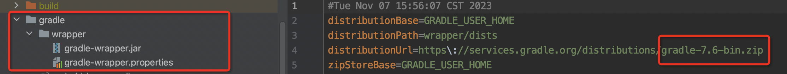

    <svg width="250" height="250" xmlns="http://www.w3.org/2000/svg" id="svgAnimation">
    
    </svg>  

## Version restrictions

Minimum Gradle version: 7.6👇 (supports 8.0 and above)

Minimum SDK version: minSdkVersion >= 21

## Star trend chart

---

Welcome to the AndroidAOP wiki document, click on the left navigation bar to see what you want to see👈👈👈

It is recommended that you first browse [Getting Started](/AndroidAOP/getting_started/#custom-aspects) to quickly understand how to use this library and form a general idea before reading other content.

Choosing the right method can help you write beautiful code. If you encounter any problem, please browse the wiki document first. If you can't solve it, go to the homepage [join the group](#contact-information) to communicate

## The aspect methods provided by this library are as follows

- **@AndroidAopPointCut** is an annotation aspect. The set annotation can be added to any method. When the added method is called, the aspect processing class can be entered

- **@AndroidAopMatchClassMethod** is a matching aspect. It matches certain methods of a class. When the method of the class is called, the aspect processing class can be entered

- **@AndroidAopReplaceClass** is a replacement aspect. All calls to the method of the set class will be replaced with the method of the replacement aspect class

- **@AndroidAopModifyExtendsClass** It modifies the inherited class and replaces the inherited class of the target class with the annotated class
- **@AndroidAopCollectMethod** collects inherited classes

Except @AndroidAopPointCut, you can use [“AOP Code Generation Assistant”](https://flyjingfish.github.io/AndroidAOP/AOP_Helper/) to assist you in using this library

### The differences are as follows:
- **@AndroidAopMatchClassMethod and @AndroidAopPointCut focus on method execution**

- **@AndroidAopReplaceClass focuses on method call**

- **Note @AndroidAopReplaceClass It is essentially different from the other two. The first two focus on the execution of methods and automatically retain methods that can execute the original logic (i.e. [ProceedJoinPoint](https://flyjingfish.github.io/AndroidAOP/ProceedJoinPoint/));**

- **@AndroidAopReplaceClass focuses on the call of methods, replacing all call locations with static methods of the class you set, and does not automatically retain methods that execute the original logic**

- **_@AndroidAopReplaceClass has the advantage of "equivalent" to monitoring the call of certain system methods (code in android.jar), which the first two do not have. Therefore, if it is not based on this requirement, it is recommended to use [@AndroidAopMatchClassMethod](https://flyjingfish.github.io/AndroidAOP/AndroidAopMatchClassMethod/)_**

## Appreciation

You have read this far. If you like AndroidAOP or feel that AndroidAOP has helped you, you can click the "Star" in the upper right corner to support it. Your support is my motivation. Thank you~ 😃

If you feel that AndroidAOP has saved you a lot of development time and added luster to your project, you can also scan the QR code below to buy the author a cup of coffee ☕

### [Donation List](/AndroidAOP/zh/give_list)

If you note your name in the donation message, it will be recorded in the list~ If you are also a github open source author, you can leave the github project address or personal homepage address when donating, and the link will be added to the list

## Contact information

* If you have any questions, you can join the group to discuss [Click here to join QQ group: 641697838](https://qm.qq.com/cgi-bin/qm/qr?k=w2qDbv_5bpLl0lO0qjXxijl3JHCQgtXx&jump_from=webapi&authKey=Q6/YB+7q9BvOGbYv1qXZGAZLigsfwaBxDC8kz03/5Pwy7018XunUcHoC11kVLqCb)

