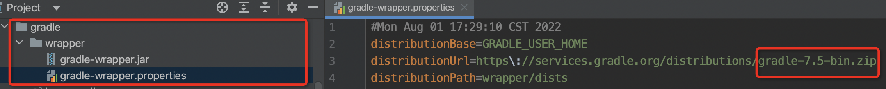
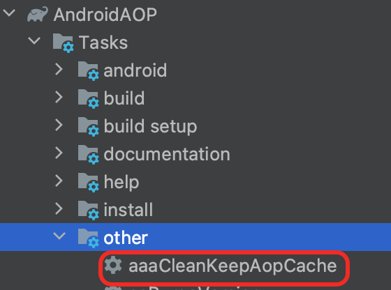

## 版本限制

最低Gradle版本：7.6👇（支持8.0以上）



最低SDK版本：minSdkVersion >= 21

## 使用步骤

**在开始之前可以给项目一个Star吗？非常感谢，你的支持是我唯一的动力。欢迎Star和Issues!**

<p style="color:red;">本库仓库地址在 Maven central，当你获取不到依赖包时，请将 阿里等镜像地址 放在 mavenCentral() 之后</p>

### 一、引入插件，下边两种方式二选一（必须）


#### 方式一：```apply``` 方式（推荐）


在 **项目根目录** 的 `build.gradle` 里依赖插件

=== "Groovy"

    - 新版本

        ```groovy
        
        plugins {
            //👇必须项 (1)👈 apply 设置为 true 自动为所有module“预”配置 debugMode，false则按下边步骤五配置 debugMode 的手动模式
            id "io.github.flyjingfish.androidaop" version "2.7.6" apply true
        }
        ```
        
        1.  :man_raising_hand: 如果你的项目内存在 `com.google.dagger.hilt.android` 插件，请把本插件放在其之前

    - 或者老版本
        ```groovy
        buildscript {
          dependencies {
              //👇必须项 (1)👈
              classpath "io.github.flyjingfish:androidaop-plugin:2.7.6"
          }
        }
        // 👇加上这句自动为所有module“预”配置debugMode，不加则按下边步骤五配置 debugMode 的手动模式
        apply plugin: "android.aop"
        ```
        
        1.  :man_raising_hand: 如果你的项目内存在 `com.google.dagger:hilt-android-gradle-plugin` 插件，请把本插件放在其之前

=== "Kotlin"

    - 新版本

        ```kotlin
        plugins {
            //👇必须项 (1)👈 apply 设置为 true 自动为所有module“预”配置debugMode，false则按下边步骤五配置 debugMode 的手动模式
            id("io.github.flyjingfish.androidaop") version "2.7.6" apply true
        }
        ```
        
        1.  :man_raising_hand: 如果你的项目内存在 `com.google.dagger.hilt.android` 插件，请把本插件放在其之前

    - 或者老版本
        ```kotlin
        buildscript {
          dependencies {
              //👇必须项 (1)👈
              classpath("io.github.flyjingfish:androidaop-plugin:2.7.6")
          }
        }
        // 👇加上这句自动为所有module“预”配置debugMode，不加则按下边步骤五配置 debugMode 的手动模式
        apply(plugin = "android.aop")
        ```
        
        1.  :man_raising_hand: 如果你的项目内存在 `com.google.dagger:hilt-android-gradle-plugin` 插件，请把本插件放在其之前

!!! note
    **如果你的项目中使用了 hilt 插件，注意文中提到的导入插件的顺序（点击上边的 “+” 可看到更多信息）**


在 **com.android.application（以及com.android.dynamic-feature）** 的 `build.gradle` 添加

=== "Groovy"

    - 新版本
    
        ```groovy
        //必须项 👇
        plugins {
            ...
            id 'android.aop'//最好放在最后一行
        }
        ```

    - 或者老版本

        ```groovy
        //必须项 👇
        apply plugin: 'android.aop' //最好放在最后一行
        ```

=== "Kotlin"

    - 新版本
    
        ```kotlin
        //必须项 👇
        plugins {
            ...
            id("android.aop")//最好放在最后一行
        }
        ```

    - 或者老版本

        ```kotlin
        //必须项 👇
        apply(plugin = "android.aop") //最好放在最后一行
        ```

!!! warning
    **:warning::warning::warning:`id 'android.aop'` 这句尽量放在最后一行，尤其是必须在 `id 'com.android.application'` 、 `id 'com.android.library'` 或 `id 'com.android.dynamic-feature'` 的后边**


#### ~~方式二：```plugins``` 方式（不推荐）~~

- 直接在 **com.android.application（以及com.android.dynamic-feature）** 的 ```build.gradle``` 添加

=== "Groovy"

    ```groovy
    //必须项 👇
    plugins {
        ...
        id "io.github.flyjingfish.androidaop" version "2.7.6"//最好放在最后一行
    }
    ```

=== "Kotlin"

    ```kotlin
    //必须项 👇
    plugins {
        ...
        id("io.github.flyjingfish.androidaop") version "2.7.6"//最好放在最后一行
    }
    ```

### 二、如果你需要自定义切面，并且代码是 ```Kotlin``` (非必须)

- 在 **项目根目录** 的 ```build.gradle``` 里依赖插件

=== "Groovy"

    ```groovy
    plugins {
        //非必须项 👇，如果需要自定义切面，并且使用 android-aop-ksp 这个库的话需要配置 ，下边版本号根据你项目的 Kotlin 版本决定
        id 'com.google.devtools.ksp' version '1.8.0-1.0.9' apply false
    }
    ```
=== "Kotlin"

    ```kotlin
    plugins {
        //非必须项 👇，如果需要自定义切面，并且使用 android-aop-ksp 这个库的话需要配置 ，下边版本号根据你项目的 Kotlin 版本决定
        id("com.google.devtools.ksp") version "1.8.0-1.0.9" apply false
    }
    ```

[Kotlin 和 KSP Github 的匹配版本号列表](https://github.com/google/ksp/releases)

### 三、引入依赖库(必须)
=== "Groovy"

    ```groovy
    plugins {
        //非必须项 👇，如果需要自定义切面，并且使用 android-aop-ksp 这个库的话需要配置 
        id 'com.google.devtools.ksp'
    }
    
    dependencies {
        //👇必须项 
        implementation "io.github.flyjingfish:androidaop-core:2.7.6"
        //👇非必须项 (1)👈 这个包提供了一些常见的注解切面
        implementation "io.github.flyjingfish:androidaop-extra:2.7.6" 
        
        //👇必须项 如果您项目内已经有了这项不用加也可以
        implementation "androidx.appcompat:appcompat:1.3.0" // 至少在1.3.0及以上
        
        //👇二选一 (2)👈点击+查看详细说明，⚠️支持Java和Kotlin代码写的切面
        ksp "io.github.flyjingfish:androidaop-apt:2.7.6"
        
        //👇二选一 (3)👈点击+查看详细说明，⚠️只适用于Java代码写的切面
        annotationProcessor "io.github.flyjingfish:androidaop-apt:2.7.6"
        //⚠️上边的 ksp 和 annotationProcessor 二选一
        //如果只是使用 android-aop-extra 中的功能就不需要选择这两项
    }
    
    ```

    1.  :man_raising_hand: 此库内置了使用 [@AndroidAopPointCut](/AndroidAOP/zh/AndroidAopPointCut/) 定义的一些功能注解
    2.  :man_raising_hand: 当你使用[此处介绍](#_8)的五个自定义切面注解时，就意味着你必须使用 `androidaop-apt`
    3.  :man_raising_hand: 当你使用[此处介绍](#_8)的五个自定义切面注解时，就意味着你必须使用 `androidaop-apt`
=== "Kotlin"

    ```kotlin
    plugins {
        //非必须项 👇，如果需要自定义切面，并且使用 android-aop-ksp 这个库的话需要配置 
        id("com.google.devtools.ksp")
    }
    
    dependencies {
        //👇必须项 
        implementation("io.github.flyjingfish:androidaop-core:2.7.6")
        //👇非必须项 (1)👈 这个包提供了一些常见的注解切面
        implementation("io.github.flyjingfish:androidaop-extra:2.7.6")
        
        //👇必须项 如果您项目内已经有了这项不用加也可以
        implementation("androidx.appcompat:appcompat:1.3.0") // 至少在1.3.0及以上
        
        //👇二选一 (2)👈点击+查看详细说明，⚠️支持Java和Kotlin代码写的切面
        ksp("io.github.flyjingfish:androidaop-apt:2.7.6")
        
        //👇二选一 (3)👈点击+查看详细说明，⚠️只适用于Java代码写的切面
        annotationProcessor("io.github.flyjingfish:androidaop-apt:2.7.6")
        //⚠️上边的 ksp 和 annotationProcessor 二选一
        //如果只是使用 android-aop-extra 中的功能就不需要选择这两项
    }
    ```

    1.  :man_raising_hand: 此库内置了使用 [@AndroidAopPointCut](/AndroidAOP/zh/AndroidAopPointCut/) 定义的一些功能注解
    2.  :man_raising_hand: 当你使用[此处介绍](#_8)的五个自定义切面注解时，就意味着你必须使用 `androidaop-apt`
    3.  :man_raising_hand: 当你使用[此处介绍](#_8)的五个自定义切面注解时，就意味着你必须使用 `androidaop-apt`

!!! note
    提示：ksp 或 annotationProcessor只能扫描当前 module ，在哪个 module 中有自定义切面代码就加在哪个 module，**但是自定义的切面代码是全局生效的**；必须依赖项可以通过 api 方式只加到公共 module 上

### 四、在 app 的build.gradle添加 androidAopConfig 配置项（此步为可选配置项）

- 相关开发配置

=== "Groovy"

    ```groovy
    plugins {
        ...
        id 'android.aop'//最好放在最后一行
    }
    androidAopConfig {
        // enabled 为 false 切面不再起作用，默认不写为 true
        enabled true 
        // includeKotlin 为 true 扫描 kotlin、kotlinx 代码，默认不写为 false
        includeKotlin false 
        // include 不设置默认全部扫描，设置后只扫描设置的包名的代码
        include '你项目的包名','自定义module的包名','自定义module的包名'
        // exclude 是扫描时排除的包
        // 可排除 kotlin 相关，提高速度
        exclude 'kotlin.jvm', 'kotlin.internal','kotlinx.coroutines.internal', 'kotlinx.coroutines.android'
        // 排除打包的实体名
        excludePackaging 'license/NOTICE' , 'license/LICENSE.dom-software.txt' , 'license/LICENSE'

        // verifyLeafExtends 是否开启验证叶子继承，默认打开，@AndroidAopMatchClassMethod 和 @AndroidAopCollectMethod 如果没有设置 LEAF_EXTENDS，可以关闭
        verifyLeafExtends true
        //默认关闭，开启在 Build 或 打包后 将会生成切点信息文件在 app/build/tmp/(cutInfo.json、cutInfo.html)
        cutInfoJson false
    }
    android {
        ...
    }
    ```

=== "Kotlin"

    ```kotlin
    plugins {
        ...
        id("android.aop")//最好放在最后一行
    }
    androidAopConfig {
        // enabled 为 false 切面不再起作用，默认不写为 true
        enabled = true 
        // include 不设置默认全部扫描，设置后只扫描设置的包名的代码
        include("你项目的包名","自定义module的包名","自定义module的包名")
        // exclude 是扫描时排除的包
        // 可排除 kotlin 相关，提高速度
        exclude("kotlin.jvm", "kotlin.internal","kotlinx.coroutines.internal", "kotlinx.coroutines.android")
        // 排除打包的实体名
        excludePackaging("license/NOTICE" , "license/LICENSE.dom-software.txt" , "license/LICENSE")

        // verifyLeafExtends 是否开启验证叶子继承，默认打开，@AndroidAopMatchClassMethod 和 @AndroidAopCollectMethod 如果没有设置 LEAF_EXTENDS，可以关闭
        verifyLeafExtends = true
        //默认关闭，开启在 Build 或 打包后 将会生成切点信息文件在 app/build/tmp/(cutInfo.json、cutInfo.html)
        cutInfoJson = false
    }
    android {
        ...
    }
    ```

!!! note
    **1、include 和 exclude支持精确设置为一个类**<br>
    **2、合理使用 include 和 exclude 可提高编译速度，建议直接使用 include 设置你项目的相关包名（包括 app 和自定义 module 的）**<br>
    **3、@AndroidAopMatchClassMethod 和 @AndroidAopCollectMethod 如果没有设置 LEAF_EXTENDS,就主动设置 verifyLeafExtends 为 false 也可以提速**

!!! warning
    **:warning::warning::warning:设置完了 include 和 exclude 所有切面只在您设置规则之内才有效，麻烦记住自己的设置！另外设置此处之后由于 Android Studio 可能有缓存，建议先 clean 再继续开发**

### 五、开发中可设置打包方式（此步为可选配置项，建议配置此项加速开发）

#### :pushpin: 方式一（fastDex 模式）

在 **根目录** 的 `gradle.properties` 添加如下设置

```properties
androidAop.fastDex = true //加速 dexBuilder阶段（默认false）
androidAop.fastDex.variantOnlyDebug = false //只在 debug 起作用（默认false）
```

!!! note
    1、`androidAop.fastDex` 设置为 true 时则会对 dexBuilder 任务进行 **增量编译** 优化加速，请注意此项设置在不处于 debugMode 模式下才有作用<br>
    2、`androidAop.fastDex.variantOnlyDebug` 设置为 true 时 release 包会忽略 `androidAop.fastDex = true` 的设置<br>
    3、如果你项目中存在其他使用 `toTransform` 的插件，请调整任务执行顺序将 `xxAssembleAndroidAopTask` 任务放在最后，否则效果将会有所折扣<br>
    4、如果你项目有其他使用 `toTransform` 的插件，如某些 Router，建议使用本方式一


#### :pushpin: 方式二（debugMode 模式）


<p style="color:red;">如果你配置这一步的 debugMode ，请务必仔细看好下边每一行的说明，不要无脑复制，尤其是想切三方 jar 包的</p>

<p style="color:#FF8C00;">以下的配置步骤同样也适用于 组件化的场景 <a href="/AndroidAOP/zh/FAQ/#14-module-aar">点此查看</a></p>


为 **所有的子module** 也依赖插件，请按照上述 [步骤一的方式一配置项目](#apply)，然后以下方式二选一

- **自动模式：（推荐）**

    按照上述[步骤一的方式一配置项目](#apply)，就可以了。**这个方式自动为所有 Android 的 module（不包括 `com.android.dynamic-feature` 的module） 应用 debugMode**


- ~~**手动模式：（不推荐）**~~

    请按照上述[步骤一的方式一配置项目](#apply)后，手动为 **需要的子 module 模块** 设置，例如：
    === "Groovy"

        ```groovy
        plugins {
            ...
            id 'android.aop'//最好放在最后一行，尤其是必须在 `id 'com.android.application'` 或 `id 'com.android.library'` 的后边
        }
        ```
    === "Kotlin"

        ```kotlin
        plugins {
            ...
            id("android.aop")//最好放在最后一行，尤其是必须在 `id("com.android.application")` 或 `id("com.android.library")` 的后边
        }
        ```


!!! note
    **1、这个方式可以只为你加过的 module 应用 debugMode，没加的 module 里边的相关切面不会生效**<br>
    **2、如果你的 module 是 Java或Kotlin 的 Library，自动模式只能让所有的 Android 的 Library，需要采用手动模式单独为你的 module 配置才会生效，`com.android.dynamic-feature` 需要手动加上此插件**


在 **根目录** 的 `gradle.properties` 添加如下设置

```properties
androidAop.debugMode=true //设置为 true 走您项目当前的打包方式 ，false 则为全量打包方式，不写默认false
```
!!! warning
    **1、:warning::warning::warning:请注意设置为 true 时编译速度会变快但部分功能将失效，只会为设置的 module 织入 aop 代码，三方jar包 不会织入代码，因此打正式包时请注意关闭此项配置并clean项目**<br>
    2、如果设置了 `org.gradle.parallel = true`，如有bug请注意调整各个 module **compileXXJavaWithJavac** 任务的顺序，不会的可以选择直接关闭这项配置


在 **根目录** 的 `gradle.properties` 添加如下设置

```properties
androidAop.debugMode.variantOnlyDebug = true //默认不写这项就是true
```
!!! note
    1、这项不写默认就是true，请注意设置为 true 时 release 包会忽略 `androidAop.debugMode = true` 的设置自动走全量打包方式（相当于临时关闭了debugMode），设为 false 时则没有这种效果 <br>
    2、此项功能默认开启，因此release包无需手动关闭 `androidAop.debugMode` <br>
    **3、此项只对 Android 的 Library 有效,对 Java 或 Kotlin 的 Library 无效**


在 **根目录** 的 `gradle.properties` 添加如下设置（非必须项）

```properties
androidAop.debugMode.buildConfig = true //设置为 true 表示导出一个 DebugModeBuildConfig.java 文件，不写默认为 true
```

!!! note
    1、因为有些 module 的代码只有 kotlin 代码，导致 debugMode 无法生效，设置为true可插入一个 java 代码即可生效，如果不需要，可以设置为 false，但需要你手动创建一个 java 代码 <br>
    2、如果 debugMode 无法生效，可考虑关闭此项配置，添加设置 `android.defaults.buildfeatures.buildconfig=true`

#### :pushpin: 其他配置（选填，追求极致可以配置这项）

在 **根目录** 的 `gradle.properties` 添加如下设置

```properties
androidAop.reflectInvokeMethod = true //设置为 true 反射执行切面方法 ，不写默认 false
androidAop.reflectInvokeMethod.variantOnlyDebug = true // 设置为 true 则只会在 debug 下才有效，不写默认false
androidAop.reflectInvokeMethod.static = true // 设置为 true 模拟了非反射的情况，不写默认true
```
!!! note
    1、`androidAop.reflectInvokeMethod` 设置为 true 反射执行切面方法会加快打包速度，设置为 false 二次编译速度和开启反射速度是基本一样的<br>
    2、请注意`androidAop.reflectInvokeMethod.variantOnlyDebug` 设置为 true 时 release 包会忽略 `androidAop.reflectInvokeMethod = true` 的设置自动不走反射，设为 false 时则没有这种效果（不写默认false）<br>
    3、`androidAop.reflectInvokeMethod.static` 设置为 true 模拟了非反射的情况兼顾了反射的编译速度，不写默认true，如果想使用反射建议设置此项为 true。设置为 false 则为纯反射 <br>
    **4、`androidAop.reflectInvokeMethod.variantOnlyDebug` 只对 Android 的 Library 有效,对 Java 或 Kotlin 的 Library 无效**

#### :pushpin: CleanKeepAopCache

当你想要 clean 项目的时候，可以使用这个命令，方便 clean 后使编译时间减少一些

- 在命令行中使用

    ```
    ./gradlew aaaCleanKeepAopCache
    ```

- 双击命令

    

如果找不到 `aaaCleanKeepAopCache` 命令，你需要在 **根目录** 的 `build.gradle` 添加如下设置

=== "Groovy"

    ```groovy
    apply plugin: 'android.aop.clean'
    ```

=== "Kotlin"

    ```kotlin
    apply(plugin = "android.aop.clean")
    ```


### 本库内置了一些功能注解可供你直接使用

| 注解名称                     |                                                参数说明                                                 |                                        功能说明                                         |
|--------------------------|:---------------------------------------------------------------------------------------------------:|:-----------------------------------------------------------------------------------:|
| @SingleClick             |                                      value = 快速点击的间隔，默认1000ms                                       |                             单击注解，加入此注解，可使你的方法只有单击时才可进入                              |
| @DoubleClick             |                                      value = 两次点击的最大用时，默认300ms                                      |                              双击注解，加入此注解，可使你的方法双击时才可进入                               |
| @IOThread                |                                          ThreadType = 线程类型                                          |                          切换到子线程的操作，加入此注解可使你的方法内的代码切换到子线程执行                          |
| @MainThread              |                                                 无参数                                                 |                          切换到主线程的操作，加入此注解可使你的方法内的代码切换到主线程执行                          |
| @OnLifecycle<sup>*</sup> |                                       value = Lifecycle.Event                                       |                        监听生命周期的操作，加入此注解可使你的方法内的代码在对应生命周期内才去执行                        |
| @TryCatch                |                                        value = 你自定义加的一个flag                                         |                            加入此注解可为您的方法包裹一层 try catch 代码                             |
| @Permission<sup>*</sup>  |                                   tag = 自定义标记<br>value = 权限的字符串数组                                   |                            申请权限的操作，加入此注解可使您的代码在获取权限后才执行                             |
| @Scheduled               | initialDelay = 延迟开始时间<br>interval = 间隔<br>repeatCount = 重复次数<br>isOnMainThread = 是否主线程<br>id = 唯一标识 | 定时任务，加入此注解，可使你的方法每隔一段时间执行一次，调用AndroidAop.shutdownNow(id)或AndroidAop.shutdown(id)可停止 |
| @Delay                   |                         delay = 延迟时间<br>isOnMainThread = 是否主线程<br>id = 唯一标识                         |  延迟任务，加入此注解，可使你的方法延迟一段时间执行，调用AndroidAop.shutdownNow(id)或AndroidAop.shutdown(id)可取消  |
| @CheckNetwork            |                tag = 自定义标记<br>toastText = 无网络时toast提示<br>invokeListener = 是否接管检查网络逻辑                |                            检查网络是否可用，加入此注解可使你的方法在有网络才可进去                             |
| @CustomIntercept         |                                     value = 你自定义加的一个字符串数组的flag                                      |              自定义拦截，配合 AndroidAop.setOnCustomInterceptListener 使用，属于万金油              |


!!! note
    以上功能位于 `android-aop-extra` 库中，[详细说明请看文档](/AndroidAOP/zh/android_aop_extra/)


## 自定义切面

*[自定义切面]: 使用以下功能就意味着你必须从 <code>android-aop-ksp</code> 和 <code>android-aop-processor</code> 选择一项作为依赖项

本篇介绍是大纲式的大致讲解

- @AndroidAopPointCut 是为方法加注解的切面
- @AndroidAopMatchClassMethod 是匹配类的方法的切面
- @AndroidAopReplaceClass 是替换方法调用的
- @AndroidAopModifyExtendsClass 是修改继承类
- @AndroidAopCollectMethod 是收集继承类


#### 一、**@AndroidAopPointCut** 是在方法上通过注解的形式做切面的，上述中注解都是通过这个做的，[详细使用请看wiki文档](/AndroidAOP/zh/AndroidAopPointCut)

&emsp;&emsp;下面以 @CustomIntercept 为例介绍下该如何使用

- 创建注解(将 @AndroidAopPointCut 加到你的注解上)

    === "Kotlin"
        
        ```kotlin
        @AndroidAopPointCut(CustomInterceptCut::class)
        @Target(
                AnnotationTarget.FUNCTION,
                AnnotationTarget.PROPERTY_GETTER,
                AnnotationTarget.PROPERTY_SETTER
        )
        @Retention(
                AnnotationRetention.RUNTIME
        )
        annotation class CustomIntercept(vararg val value: String = [])
        ```
    
    === "Java"
    
        ```java
        @AndroidAopPointCut(CustomInterceptCut.class)
        @Target({ElementType.METHOD})
        @Retention(RetentionPolicy.RUNTIME)
        public @interface CustomIntercept {
            String[] value() default {};
        }
        ```

- 创建注解处理切面的类（需要实现 BasePointCut 接口，它的泛型填上边的注解）

    ```kotlin
    class CustomInterceptCut : BasePointCut<CustomIntercept> {
        override fun invoke(
            joinPoint: ProceedJoinPoint,
            annotation: CustomIntercept //annotation就是你加到方法上的注解
        ): Any? {
            // 在此写你的逻辑
            // joinPoint.proceed() 表示继续执行切点方法的逻辑，不调用此方法不会执行切点方法里边的代码
            // 关于 ProceedJoinPoint 可以看wiki 文档，详细点击下方链接
            return joinPoint.proceed()
        }
    }
    ```

    [关于 ProceedJoinPoint 使用说明](/AndroidAOP/zh/ProceedJoinPoint)，下文的 ProceedJoinPoint 同理

- 使用

    直接将你写的注解加到任意一个方法上，例如加到了 onCustomIntercept() 当 onCustomIntercept() 被调用时首先会进入到上文提到的 CustomInterceptCut 的 invoke 方法上
    
    ```kotlin
    @CustomIntercept("我是自定义数据")
    fun onCustomIntercept(){
        
    }
    
    ```

#### 二、**@AndroidAopMatchClassMethod** 是做匹配某类及其对应方法的切面的

&emsp;&emsp;**匹配方法支持精准匹配，[点此看wiki详细使用文档](/AndroidAOP/zh/AndroidAopMatchClassMethod)**


- 例子一

    ```java
    package com.flyjingfish.test_lib;
    
    public class TestMatch {
        public void test1(int value1,String value2){
    
        }
    
        public String test2(int value1,String value2){
            return value1+value2;
        }
    }
    
    ```

    假如 TestMatch 是要匹配的类，而你想要匹配到 test2 这个方法，下边是匹配写法：


    ```kotlin
    package com.flyjingfish.test_lib.mycut;
    
    @AndroidAopMatchClassMethod(
            targetClassName = "com.flyjingfish.test_lib.TestMatch",
            methodName = ["test2"],
            type = MatchType.SELF
    )
    class MatchTestMatchMethod : MatchClassMethod {
      override fun invoke(joinPoint: ProceedJoinPoint, methodName: String): Any? {
        Log.e("MatchTestMatchMethod","======"+methodName+",getParameterTypes="+joinPoint.getTargetMethod().getParameterTypes().length);
        // 在此写你的逻辑 
        //不想执行原来方法逻辑，👇就不调用下边这句
        return joinPoint.proceed()
      }
    }
    
    ```

    可以看到上方 AndroidAopMatchClassMethod 设置的 type 是 MatchType.SELF 表示只匹配 TestMatch 这个类自身，不考虑其子类
    
    :warning: :warning: :warning: 不是所有类都可以Hook进去，```type``` 类型为 ```SELF``` 时，```targetClassName``` 所设置的类必须是安装包里的代码。例如：Toast 这个类在 **android.jar** 里边是不行的

- 例子二

    假如想 Hook 所有的 android.view.View.OnClickListener 的 onClick，说白了就是想全局监测所有的设置 OnClickListener 的点击事件，代码如下：
    
    ```kotlin
    @AndroidAopMatchClassMethod(
        targetClassName = "android.view.View.OnClickListener",
        methodName = ["onClick"],
        type = MatchType.EXTENDS //type 一定是 EXTENDS 因为你想 hook 所有继承了 OnClickListener 的类
    )
    class MatchOnClick : MatchClassMethod {
    //    @SingleClick(5000) //联合 @SingleClick ，给所有点击增加防多点，6不6
        override fun invoke(joinPoint: ProceedJoinPoint, methodName: String): Any? {
            Log.e("MatchOnClick", "=====invoke=====$methodName")
            return joinPoint.proceed()
        }
    }
    ```
    
    可以看到上方 AndroidAopMatchClassMethod 设置的 type 是 MatchType.EXTENDS 表示匹配所有继承自 OnClickListener 的子类，另外更多继承方式，[请参考Wiki文档](/AndroidAOP/zh/@AndroidAopMatchClassMethod/#_1)
    
    **:warning:注意：如果子类没有该方法，则切面无效，使用 overrideMethod 可忽略此限制[详情点此](/AndroidAOP/zh/AndroidAopMatchClassMethod)**

#### 三、**@AndroidAopReplaceClass** 是做替换方法调用的

&emsp;&emsp;此方式是对 @AndroidAopMatchClassMethod 的一个补充，[点此看wiki详细说明文档](/AndroidAOP/zh/AndroidAopReplaceClass)

- Java写法

    ```java
    @AndroidAopReplaceClass(
            "android.widget.Toast"
    )
    public class ReplaceToast {
        @AndroidAopReplaceMethod(
                "android.widget.Toast makeText(android.content.Context, java.lang.CharSequence, int)"
        )
        //  因为被替换方法是静态的，所以参数类型及顺序和被替换方法一一对应
        public static Toast makeText(Context context, CharSequence text, int duration) {
            return Toast.makeText(context, "ReplaceToast-"+text, duration);
        }
        @AndroidAopReplaceMethod(
                "void setGravity(int , int , int )"
        )
        //  因为被替换方法不是静态方法，所以参数第一个是被替换类，之后的参数和被替换方法一一对应
        public static void setGravity(Toast toast,int gravity, int xOffset, int yOffset) {
            toast.setGravity(Gravity.CENTER, xOffset, yOffset);
        }
        @AndroidAopReplaceMethod(
                "void show()"
        )
        //  虽然被替换方法没有参数，但因为它不是静态方法，所以第一个参数仍然是被替换类
        public static void show(Toast toast) {
            toast.show();
        }
    }
    ```

    该例意思就是凡是代码中写```Toast.makeText```和```Toast.show```  ...的地方都被替换成```ReplaceToast.makeText```和```ReplaceToast.show``` ...

- Kotlin写法

    ```kotlin
    
    @AndroidAopReplaceClass("android.util.Log")
    object ReplaceLog {
        @AndroidAopReplaceMethod("int e(java.lang.String,java.lang.String)")
        @JvmStatic
        fun e( tag:String, msg:String) :Int{
            return Log.e(tag, "ReplaceLog-$msg")
        }
    }
    
    
    ```
    
    该例意思就是凡是代码中写```Log.e```的地方都被替换成```ReplaceLog.e```


#### 四、**@AndroidAopModifyExtendsClass** 是修改目标类的继承类

&emsp;&emsp;通常是在某个类的继承关系中替换掉其中一层，然后重写一些函数，在重写的函数中加入一些你想加的逻辑代码，起到监听、改写原有逻辑的作用，[详细使用方式](/AndroidAOP/zh/AndroidAopModifyExtendsClass)

- 示例

    ```java
    @AndroidAopModifyExtendsClass("androidx.appcompat.widget.AppCompatImageView")
    public class ReplaceImageView extends ImageView {
        public ReplaceImageView(@NonNull Context context, @Nullable AttributeSet attrs) {
            super(context, attrs);
        }
    
        @Override
        public void setImageDrawable(@Nullable Drawable drawable) {
            super.setImageDrawable(drawable);
            //做一些监测或者再次修改
        }
    }
    ```

    该例就是要把 ```AppCompatImageView``` 的继承类替换成 ```ReplaceImageView```

#### 五、**@AndroidAopCollectMethod** 是收集继承类

&emsp;&emsp;使用起来极其简单，示例代码已经说明了[详细使用方式](/AndroidAOP/zh/AndroidAopCollectMethod)

- 示例
    
    === "Kotlin"
    
        ```kotlin
        object InitCollect {
            private val collects = mutableListOf<SubApplication>()
            private val collectClazz: MutableList<Class<out SubApplication>> = mutableListOf()
        
            @AndroidAopCollectMethod
            @JvmStatic
            fun collect(sub: SubApplication){
              collects.add(sub)
            }
            @AndroidAopCollectMethod
            @JvmStatic
            fun collect2(sub:Class<out SubApplication>){
              collectClazz.add(sub)
            }
          //直接调这个方法（方法名不限）上边的函数会被悉数回调
            fun init(application: Application){
                for (collect in collects) {
                    collect.onCreate(application)
                }
            }
        }
        ```
    === "Java"
    
        ```java
        public class InitCollect2 {
            private static final List<SubApplication2> collects = new ArrayList<>();
            private static final List<Class<? extends SubApplication2>> collectClazz = new ArrayList<>();
    
            @AndroidAopCollectMethod
            public static void collect(SubApplication2 sub){
                collects.add(sub);
            }
        
            @AndroidAopCollectMethod
            public static void collect3(Class<? extends SubApplication2> sub){
                collectClazz.add(sub);
            }
          //直接调这个方法（方法名不限）上边的函数会被悉数回调
            public static void init(Application application){
                Log.e("InitCollect2","----init----");
                for (SubApplication2 collect : collects) {
                    collect.onCreate(application);
                }
            }
        }
        ```
